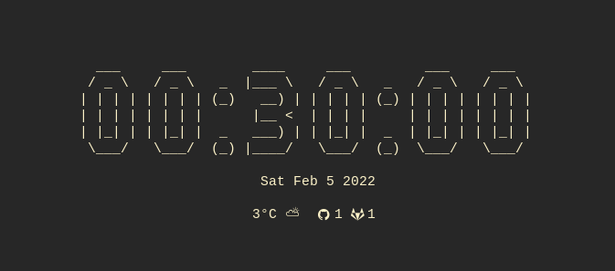

# 🔆 dashboard



# Install

```shell
go install github.com/zapling/dashboard@latest
```

## Dependencies

- [weatherapplet](https://github.com/zapling/i3blocks-weather-applet-yrno)

```shell
export DASHBOARD_GITHUB_TOKEN=xxx
export DASHBOARD_GITLAB_TOKEN=xxx
```
